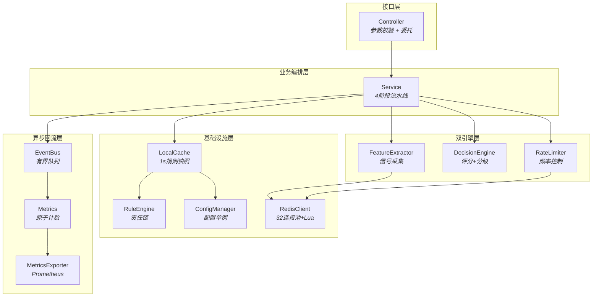

# 高并发实时风控/限流决策系统

C++17 实现的双引擎（风控评分 + 限流）系统，支持单机 **10w QPS**，P99 延迟 **< 2ms**。

---

## 快速开始

### 1. 检查环境

```bash
g++ --version   # 需要 GCC 8+ / Clang 10+（Windows 上使用 MinGW-w64）
cmake --version # 需要 3.14+
```

### 2. 安装依赖

```bash
# Ubuntu / Debian
sudo apt install libhiredis-dev cmake g++

# macOS
brew install hiredis cmake

# Windows (MinGW-w64)
#   hiredis 无预编译包，从源码编译安装（2 分钟）：
git clone --depth 1 https://github.com/redis/hiredis.git /tmp/hiredis
cd /tmp/hiredis && mkdir build && cd build
cmake .. -G "MinGW Makefiles" -DCMAKE_INSTALL_PREFIX=/你的MinGW安装路径
cmake --build .
cmake --install .
```

### 3. 编译

```bash
cd rate_limiter
mkdir build && cd build

# Linux / macOS
cmake ..

# Windows (MinGW-w64) — 需指定生成器 + hiredis 安装路径
cmake .. -G "MinGW Makefiles" -DCMAKE_PREFIX_PATH=/你的MinGW安装路径

# 统一构建命令
cmake --build .
```

编译产出三个可执行文件：

| 文件 | 用途 |
|------|------|
| `rate_limiter_demo` | 演示程序：10w 请求压测，输出 QPS/拒绝率 |
| `unit_test` | 单元测试（10 个用例，**无需 Redis**） |
| `benchmark` | 可配置的压测工具 |

### 4. 先跑单元测试（不需要 Redis）

```bash
# Linux / macOS
./unit_test

# Windows — 需确保 hiredis.dll 在 PATH 中（或放在 exe 同目录）
PATH="/d/mingw64/bin:$PATH" ./unit_test.exe
```

预期输出：

```
=== Unit Tests (10 cases, no external deps) ===
[PASS] Whitelist short-circuit
[PASS] Blacklist short-circuit
[PASS] Dimension rule matching
[PASS] DecisionEngine threshold (ALLOW)
[PASS] DecisionEngine threshold (LIMIT)
[PASS] DecisionEngine threshold (CHALLENGE)
[PASS] DecisionEngine threshold (REJECT)
[PASS] AdditiveScorer rule + feature
[PASS] CompositeCondition AND/OR
[PASS] KeyBuilder format
=== 10/10 tests passed ===
```

### 5. 启动 Redis 后跑演示程序

```bash
# Linux / macOS
redis-server --daemonize yes   # 后台启动 Redis
./rate_limiter_demo

# Windows — Redis 通常作为服务运行，或手动启动 redis-server.exe
PATH="/d/mingw64/bin:$PATH" ./rate_limiter_demo.exe
```

预期输出：

```
=== Rate Limit System Starting ===
=== System Ready ===
Requests: 100000
Allowed:  98234
Rejected: 1766
QPS:      45210
Reject%:  1.77%
Degraded: 0
Duration: 2212ms
```

如果 Redis 没启动，程序会自动降级运行（输出 `[WARN] Redis not available`）。

---

## 建议阅读顺序

| 步骤 | 文件 |  | 目的 |
|------|------|------|------|
| 1 | [docs/trace_a_request.md](docs/trace_a_request.md) |  | 跟一个请求走完所有代码，建立调用链心智模型 |
| 2 | [src/service/rate_limit_service.cpp](src/service/rate_limit_service.cpp) |  | 核心业务编排——4 阶段流水线 |
| 3 | [include/decision_engine/decision_engine.h](include/decision_engine/decision_engine.h) |  | 风控评分引擎——Feature → Score → Decision 三层 |
| 4 | [include/rate_limiter/rate_limiter.h](include/rate_limiter/rate_limiter.h) |  | 限流器——固定窗口/滑动窗口/分片 |
| 5 | [docs/design_decisions.md](docs/design_decisions.md) |  | 10 条设计决策，每条含量化依据 |

之后按需深入其他模块（EventBus、Metrics、LocalCache、RedisClient）。

---

## 项目背景

### 业务场景

API 网关收到请求后，两个引擎**串联**工作：

| 阶段 | 问题 | 引擎 |
|------|------|------|
| 风控评分 | "这个请求有多大风险？" | DecisionEngine（多特征 → 评分 → 分级） |
| 频率控制 | "这个请求还能来多少次？" | RateLimiter（计数 → 阈值 → 放行/拒绝） |

### 性能目标

- 单机 **10w QPS** 判定吞吐
- P99 延迟 **< 2ms**（含 Redis 网络往返）
- 降级可用：Redis 故障时自动 **fail-open**
- 可替换评分策略：规则累加 ↔ 加权分组 ↔ ML 模型

---

## 架构设计

### 模块总览（12 个模块，4 层）



**分层视图（同步链路）：**

```
┌──────────────────────────────────────────────────────────────┐
│  Controller    接口层——参数校验 / 委托 Service                │
├──────────────────────────────────────────────────────────────┤
│  Service       业务编排——4 阶段流水线                        │
├────────────┬──────────────────┬──────────────────────────────┤
│ Feature    │  DecisionEngine  │  RateLimiter                 │
│ Extractor  │                  │                              │
│ "你是谁？"  │  "有多危险？"      │  "还能来多少次？"              │
├────────────┴──────────────────┴──────────────────────────────┤
│  RuleEngine · LocalCache · ConfigManager · RedisClient        │
├──────────────────────────────────────────────────────────────┤
│  EventBus → Metrics → MetricsExporter（异步，不阻塞主链路）   │
└──────────────────────────────────────────────────────────────┘
```

### 每个模块一句话

| 模块 | 职责 |
|------|------|
| **Controller** | 门卫——校验参数，委托 Service |
| **Service** | 导演——编排 Feature → Score → Limit → Event 全流程 |
| **FeatureExtractor** | 侦察兵——从请求中提取风险信号（QPS、时间、API 敏感度） |
| **DecisionEngine** | 法官——根据规则+特征打分，判定风险等级 |
| **RateLimiter** | 计数器——Redis ZSet + Lua 原子判定频率 |
| **RuleEngine** | 规则匹配——责任链模式，匹配适用的限流/风控规则 |
| **LocalCache** | 快照——1 秒刷新规则配置，免去每次加锁读取 |
| **ConfigManager** | 配置中心——单例，管理所有可调参数 |
| **RedisClient** | 存储层——32 连接池 + Lua 原子执行 + 熔断 |
| **EventBus** | 快递员——异步投递事件，不阻塞主链路 |
| **Metrics** | 仪表盘——原子计数器 + 滑动窗口 + Prometheus 导出 |
| **MetricsExporter** | 暴露 `/metrics` 端点供 Prometheus pull |

---

## 请求处理流程

```
Request 进入 Controller
    │
    ▼
Service.process(req)
    │
    ├── Phase 0: FastPath (LocalCache, 0 网络开销)
    │   ├── 白名单 → ALLOW
    │   └── 黑名单 → REJECT
    │
    ├── Phase 1: Feature Extraction
    │   ├── StaticExtractor  → api_sensitivity, time_hour, account_age
    │   └── VelocityExtractor → qps_1min, qps_5min, burst_ratio
    │
    ├── Phase 2: Rule Matching (LocalCache)
    │   └── getRiskRules(req) → 匹配的风控规则列表
    │
    ├── Phase 3: Risk Scoring (DecisionEngine)
    │   ├── AdditiveScorer → totalScore
    │   └── scoreToDecision(totalScore) → ALLOW / LIMIT / CHALLENGE / REJECT
    │
    ├── Phase 4: Action Dispatch
    │   ├── ALLOW     → 直接放行，不进 RateLimiter
    │   ├── LIMIT     → RateLimiter.checkRuleWithQuota(收紧配额)
    │   ├── CHALLENGE → 返回 CHALLENGE 标记
    │   └── REJECT    → 直接拒绝
    │
    └── 异步: publishRiskEvent() → EventBus → Metrics
```

---

## 核心设计要点

### Feature → Score → Decision 三层解耦

这是本系统最核心的设计模式：

```
Layer 1: Feature      → "你是谁？"    IFeatureExtractor 接口
Layer 2: Score        → "多危险？"    IScorer 接口（3 种策略）
Layer 3: Decision     → "怎么处理？"  ThresholdConfig（可热加载）
```

任何一层可独立替换，不影响其他层。

### 限流算法

| 算法 | 实现 | Redis 操作 |
|------|------|-----------|
| 固定窗口 | `FixedWindowLimiter` | INCR + EXPIRE（两次命令） |
| 滑动窗口 | `SlidingWindowLimiter` | Lua 脚本（ZSet 原子操作，1 次往返） |

### 热点 Key 分片

不分片时热点用户单 ZSet key 成为瓶颈 → **16 分片**将压力降到 1/16。每个分片配额 = 总配额 / 16，写入随机选分片，误差 ±6.25%。

### 降级策略（三层）

1. Redis 不可用 → **fail-open** 放行
2. 单个 Extractor 失败 → 该特征填 `defaultSafe`，不阻断
3. DecisionEngine 为 null → 退化为纯限流模式

### 数据回流（异步）

主链路同步返回后，异步发布 `RiskEvent` 到有界队列（65536），后台线程消费 → 更新 Metrics。队列满则静默丢弃，绝不阻塞请求线程。

---

## 构建与运行

### 依赖

- C++17（GCC 8+ / Clang 10+）
- [hiredis](https://github.com/redis/hiredis)
- CMake 3.14+ / pthread

### 编译

```bash
cd rate_limiter
mkdir build && cd build
cmake ..
make -j$(nproc)
```

### 运行

```bash
./unit_test              # 10 个单元测试，无需 Redis
redis-server &           # 启动 Redis
./rate_limiter_demo      # 演示程序：10w 请求压测
./benchmark --qps 10000 --duration 10 --threads 8 --redis
```

---

## 目录结构

```
rate_limiter/
├── README.md
├── CMakeLists.txt
├── docs/
│   ├── trace_a_request.md          # ★ 跟着一个请求走完全流程
│   ├── design_decisions.md         # 10 条设计决策 + 量化依据
│   ├── class_design.md             # 类设计草案（与实际实现有差异）
│   └── interview_guide.md          # 面试讲解模板 + 高频追问
├── scripts/
│   └── rate_limit.lua              # 滑动窗口 Lua 脚本
├── include/
│   ├── common/common.h             # 共享类型 / 线程池 / 时间工具
│   ├── controller/rate_limit_controller.h
│   ├── service/rate_limit_service.h
│   ├── rule_engine/rule.h / rule_handler.h / rule_engine.h
│   ├── decision_engine/feature.h / risk_rule.h / decision_engine.h / feature_extractor.h
│   ├── event/risk_event.h          # RiskEvent 值对象
│   ├── event_bus/event_queue.h / event_producer.h / event_consumer.h
│   ├── metrics/metrics.h / aggregator.h / metrics_exporter.h
│   ├── rate_limiter/rate_limiter.h
│   ├── redis_client/redis_client.h
│   ├── local_cache/local_cache.h
│   └── config_manager/config_manager.h
├── src/
│   ├── main.cpp
│   ├── controller/ / service/ / rule_engine/ / decision_engine/
│   ├── event_bus/ / metrics/ / rate_limiter/ / redis_client/
│   ├── local_cache/ / config_manager/
└── test/
    ├── benchmark.cpp
    └── unit_test.cpp
```
